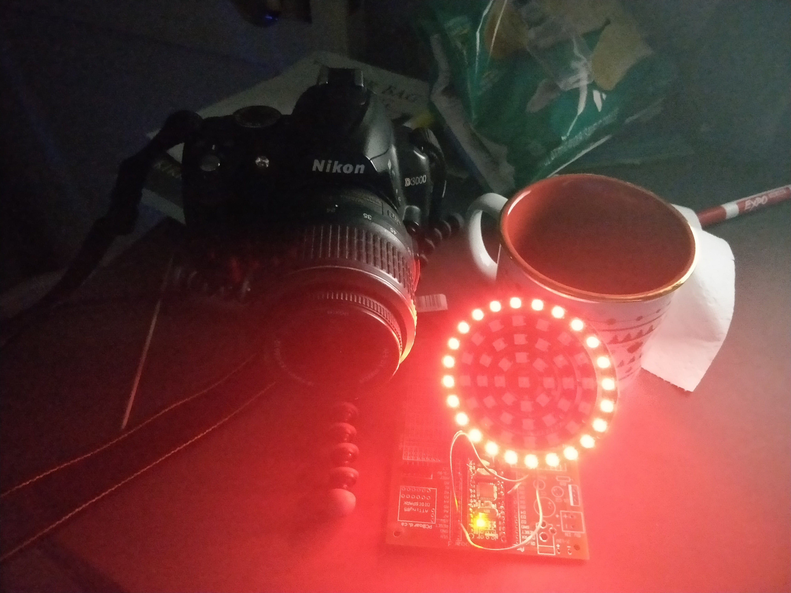

This image is a by-product of a "leadership training via photography" session
that I did. It was captured with a single exposure and a programmable light
ring.

<!-- excerpt -->

For this project I borrowed my partner's SLR camera that allowed for manual
control of the exposure length and turned it to the maximum. The small tripod I
had could hold up the weight of the camera.

For a light source I used a [NeoPixel
Ring](https://www.adafruit.com/product/1586) which is a circle of RBG LEDs that
can be controlled with a single serial line.

I connected this to a Arduino Nano. I connected this to the USB port of my
computer which had limited output so I only connected the outer ring of LEDs.
The program I wrote turned the light on some colour, waited some amount of
time, then turned the light off.

By turning the light on an off different colours with a long exposure I was
able to achieve the effect seen above.
